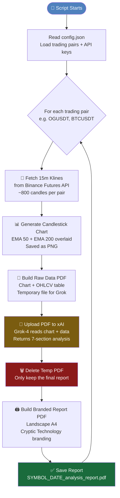
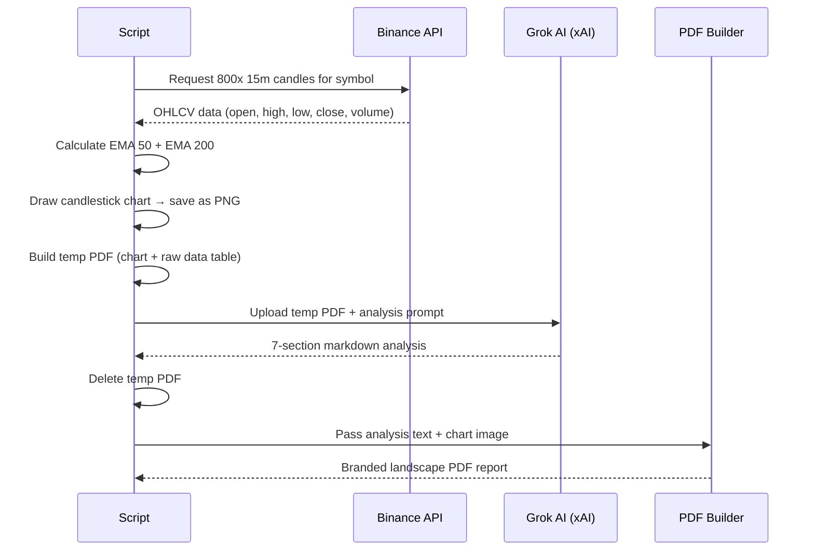

# CryptoLens AI — Automated Crypto Analysis Reports

> **Pull the repo. Add your keys. Run the script. Get a beautiful branded PDF report for every trading pair you care about — automatically.**

Built by **Cryptic Technology** · Cape Town, South Africa

---

## What Does This Script Actually Do?

In plain English: you give it a list of crypto trading pairs (like `BTCUSDT`, `ETHUSDT`), and it:

1. **Pulls live candle data** from Binance Futures (800 candles of 15-minute price history per pair)
2. **Draws a professional candlestick chart** with EMA 50 and EMA 200 overlays
3. **Sends the data to Grok AI** (xAI's model) which reads the chart like an experienced trader would
4. **Writes a full analysis** covering market mood, candle patterns, key price levels, EMA momentum, a trade idea with entry/stop/target, and a clear BUY / SELL / WAIT signal
5. **Generates a branded PDF report** in landscape format with your Cryptic Technology logo, background, contact details, and all the analysis laid out cleanly

You end up with one PDF per trading pair, saved in the same folder as the script. That's it.

---

## How the Flow Works



---

## What's Inside Each Report

Every PDF has **2 pages**:

### Page 1 — Cover
- Your **Cryptic Technology logo** and branded background
- The **trading pair name** in large text
- Report date, timeframe
- Your contact details
- A metadata strip (instrument, timeframe, date, source, AI model used)

### Page 2+ — Analysis
- The **candlestick chart** (full width landscape)
- **7 analysis sections** from Grok AI:

| # | Section | What it tells you |
|---|---------|------------------|
| 01 | Market Overview | Is it trending up, down, or sideways? |
| 02 | Candle Patterns | Bullish engulfing, doji, hammer etc. with plain English explanations |
| 03 | Key Price Levels | Where support and resistance are, and what happens if price breaks them |
| 04 | EMA Momentum | What the EMA 50 and 200 are saying about trend strength |
| 05 | Trade Setup | One clear trade: direction, entry zone, stop loss, take profit, risk/reward |
| 06 | Signal | **BUY / SELL / WAIT** — bold coloured badge with a one-line reason |
| 07 | Risk Factors | What could go wrong and what to watch out for |

---

## Project Structure

```
crypto-analyzer/
│
├── crypto_analyzer.py       # ← The main script (this is what you run)
├── config.json              # ← Your settings and API keys (you create this)
├── .env                     # ← Your xAI API key (you create this)
│
├── img/
│   ├── logo_2.png           # Cryptic Technology logo
│   └── Doc_head_page.JPG    # Cover page background
│
├── requirements.txt         # Python dependencies
└── README.md                # This file
```

> Output files are saved in the **same directory** as the script:
> - `OGUSDT_2026-02-24_15m_chart.png`
> - `OGUSDT_2026-02-24_analysis_report.pdf`

---

## Setup — Step by Step

### Step 1 — Prerequisites

You need **Python 3.10 or higher** installed on your machine.

Check your version:
```bash
python --version
```

If you don't have Python, download it from [python.org](https://www.python.org/downloads/).

---

### Step 2 — Clone the Repo

```bash
git clone https://github.com/your-org/crypto-analyzer.git
cd crypto-analyzer
```

---

### Step 3 — Install Dependencies

```bash
pip install -r requirements.txt
```

What gets installed:

| Package | What it does |
|---------|-------------|
| `binance-futures-connector` | Talks to Binance's API to get price data |
| `matplotlib` | Draws the candlestick charts |
| `reportlab` | Builds the PDF reports |
| `pypdf` | Merges the cover page with the analysis pages |
| `xai-sdk` | Connects to Grok AI for analysis |
| `python-dotenv` | Reads your `.env` file for secrets |

---

### Step 4 — Get Your API Keys

You need **two sets of API keys**:

#### A) Binance API Keys
1. Log in to [binance.com](https://www.binance.com)
2. Go to **Profile → API Management**
3. Create a new API key
4. Enable **"Enable Reading"** permission (you do NOT need trading permissions)
5. Copy your **API Key** and **Secret Key**

> ⚠️ Never enable withdrawal permissions on an API key used for analysis scripts.

#### B) xAI (Grok) API Key
1. Go to [console.x.ai](https://console.x.ai)
2. Sign up / log in
3. Go to **API Keys** and create a new key
4. Copy it

---

### Step 5 — Create Your Config Files

#### `config.json`
Create this file in the root of the project:

```json
{
    "api_key": "your_binance_api_key_here",
    "api_secret": "your_binance_secret_key_here",
    "trading_pair": ["OGUSDT", "BTCUSDT", "ETHUSDT"]
}
```

> Add as many pairs as you want in the `trading_pair` list. The script will process each one automatically.

#### `.env`
Create this file in the root of the project:

```
XAI_API_KEY=your_xai_api_key_here
```

> This file should **never** be committed to Git. It's already in `.gitignore`.

---

### Step 6 — Add Your Brand Assets

Place these two files in the `img/` folder:

- `img/logo_2.png` — Your company logo (PNG with transparent background works best)
- `img/Doc_head_page.JPG` — Your cover page background image

---

### Step 7 — Run It

```bash
python crypto_analyzer.py
```

That's it. Watch the logs — you'll see it fetch data, generate charts, call Grok, and save the PDFs.

---

## Customising the Trading Pairs

Just edit `config.json`. Add or remove pairs from the list:

```json
{
    "trading_pair": ["BTCUSDT", "ETHUSDT", "SOLUSDT", "BNBUSDT", "OGUSDT"]
}
```

The script loops through every pair in the list. Each one gets its own chart and report PDF.

---

## Understanding the Output Files

After running, you'll have files like:

```
BTCUSDT_2026-02-24_15m_chart.png        ← The candlestick chart image
BTCUSDT_2026-02-24_analysis_report.pdf  ← The full branded PDF report
ETHUSDT_2026-02-24_15m_chart.png
ETHUSDT_2026-02-24_analysis_report.pdf
```

The chart PNGs are kept so you can use them elsewhere if needed. The raw data PDFs (used internally to feed Grok) are automatically deleted after the report is generated — they're temporary.

---

## How the AI Analysis Works



The prompt sent to Grok instructs it to act as an experienced crypto trader explaining the chart to a beginner. It's asked to give a **decisive verdict** (not hedge everything as "wait") and to explain every piece of jargon it uses.

---

## The Signal Badge

The most prominent part of each report is the signal badge — a full-width coloured block that makes the verdict impossible to miss:

| Signal | Colour | Meaning |
|--------|--------|---------|
| **BUY / LONG** | 🟢 Green | Grok sees a bullish setup worth entering |
| **SELL / SHORT** | 🔴 Red | Grok sees a bearish setup worth entering |
| **WAIT / HOLD** | 🟡 Amber | Chart is ambiguous — no clear edge right now |

Grok is instructed to only give WAIT when the chart is genuinely unclear. If there's a reasonable setup forming, it commits to BUY or SELL.

---

## Switching Back to Live Grok Analysis

The repo ships with a **mock analysis mode** for testing — so you can generate and check the PDFs without using any API credits.

When you're ready to go live, open `crypto_analyzer.py` and swap the `analyze_with_grok` function:

1. **Delete** the current `analyze_with_grok` function (the one that returns mock text)
2. **Uncomment** the full implementation below it (the one that calls `client_xai`)

The commented-out version is clearly marked in the file.

---

## Troubleshooting

**`Config file not found: config.json`**
→ Make sure `config.json` exists in the same folder as `crypto_analyzer.py`.

**`Invalid or missing 'trading_pair'`**
→ Check your `config.json` — `trading_pair` must be a list, even for one pair: `["OGUSDT"]`

**`Logo embed failed`**
→ Check that `img/logo_2.png` and `img/Doc_head_page.JPG` exist. The script will fall back to a plain white background if they're missing.

**Binance API errors**
→ Make sure your API key has "Enable Reading" turned on. If you're outside a supported region, you may need a VPN or to use Binance's testnet.

**xAI errors**
→ Check that your `XAI_API_KEY` in `.env` is valid and has available credits at [console.x.ai](https://console.x.ai).

**PDF looks cut off / overlapping**
→ This is usually a `topMargin` issue. The analysis pages need enough top margin to clear the header bar (33pt) and the metadata strip (36pt). The current setting of `topMargin=82` handles this — don't reduce it.

---

## Requirements File

Save this as `requirements.txt` in the project root:

```
binance-futures-connector
matplotlib
reportlab
pypdf
xai-sdk
python-dotenv
```

---

## Security Notes

- **Never commit `config.json` or `.env` to Git** — they contain your API keys
- Add both to `.gitignore`:
  ```
  config.json
  .env
  ```
- Your Binance key only needs **read permission** — no trading, no withdrawals
- The script does not place any trades. It only reads market data.

---

## Built With

- **Python 3.10+**
- **Binance Futures Connector** — official Binance Python SDK
- **Matplotlib** — chart generation
- **ReportLab** — PDF generation (low-level canvas + Platypus flowables)
- **pypdf** — PDF merging (cover + body pages)
- **xAI SDK** — Grok-4 AI analysis
- **python-dotenv** — environment variable management

---

*Cryptic Technology · Cape Town · hrothmann704@gmail.com*